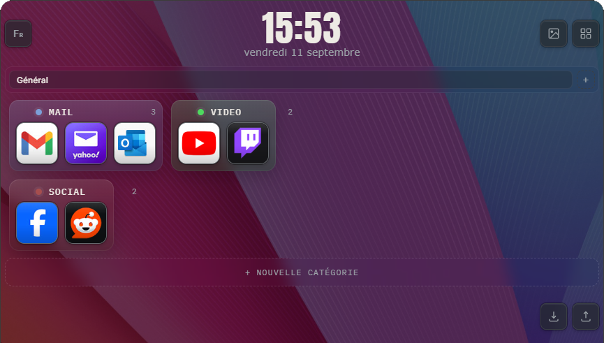

# [Fr] ATRIUM

Un tableau de bord web simple, personnalisable et entièrement local pour organiser vos sites web et services en ligne préférés.

A simple, customizable and fully local web dashboard for organizing your favorite websites and online services.

# Atrium

Une page d'accueil de navigateur personnelle — un unique fichier HTML autonome qui transforme votre nouvel onglet en un espace clair et organisé pour vos raccourcis. Pas de serveur, pas de compte, pas d'outils de build, pas de publicité. Un seul fichier à héberger gratuitement et à faire complètement vôtre.

Le nom vient de l'atrium des maisons romaines : l'espace central autour duquel s'organisait tout le reste.

## Ce que ça fait

- **Tuiles cliquables.** Chaque tuile est un raccourci vers le site de votre choix, qui s'ouvre dans un nouvel onglet.
- **Icônes automatiques.** Les tuiles récupèrent automatiquement le favicon du site, ou vous pouvez importer votre propre image — elle remplit alors toute la tuile.
- **Catégories.** Regroupez vos tuiles dans des catégories nommées et colorées, que vous pouvez placer où vous voulez sur la page — y compris en laissant de grands espaces vides entre elles.
- **Accrochage magnétique.** Approchez une catégorie du bord d'une autre pendant le glisser, et elle s'y accole parfaitement, pour construire des agencements nets côte à côte sans réglage au pixel près.
- **Largeur automatique.** La largeur d'une catégorie s'ajuste toute seule au nombre de tuiles qu'elle contient — plus d'espace perdu. Vous préférez la régler vous-même ? Faites glisser sa poignée de redimensionnement, votre choix est mémorisé ; double-cliquez dessus pour redonner la main à l'ajustement automatique.
- **Onglets.** Organisez vos catégories en plusieurs onglets — un par thème, projet ou contexte — avec une barre d'onglets qui occupe toute la largeur de la page.
- **Glisser-déposer des tuiles.** Réordonnez vos tuiles au sein d'une catégorie, ou déplacez-les vers une autre, simplement en les faisant glisser.
- **Couleurs personnalisées.** Donnez à chaque catégorie la couleur de votre choix via une palette infinie, et choisissez votre propre couleur d'accentuation pour les effets de survol sur toute la page.
- **Fond d'écran personnalisable.** Choisissez parmi des dégradés prédéfinis, une couleur unie, ou importez votre propre image.
- **Interface bilingue.** Basculez toute l'interface entre le français et l'anglais en un clic — y compris les noms des jours et des mois de l'horloge.
- **Horloge en direct.** Une horloge centrée avec l'heure et la date actuelles, toujours visible.
- **Tout reste en local.** Toutes vos tuiles, catégories, couleurs et fond d'écran sont stockés dans le stockage local de votre navigateur. Rien n'est envoyé à un serveur, puisqu'il n'y en a pas.

## Pour commencer

1. Téléchargez `index.html`.
2. Ouvrez-le directement dans votre navigateur — ça fonctionne immédiatement, sans aucune configuration.
3. Pour obtenir une vraie URL (et l'utiliser comme page d'accueil de votre navigateur), hébergez-le gratuitement :
   - Créez un dépôt GitHub, ajoutez-y `index.html`, puis activez **GitHub Pages** dans les paramètres du dépôt.
   - Des alternatives comme Cloudflare Pages ou Vercel fonctionnent tout aussi bien pour un simple fichier statique.

## Bon à savoir

- Les données étant stockées dans le stockage local du navigateur, votre configuration est propre à un navigateur sur un appareil donné. Elle ne se synchronise pas entre plusieurs ordinateurs ou navigateurs.
- Tout — mise en page, style et comportement — vit dans cet unique fichier HTML, ce qui le rend facile à lire, modifier ou reprendre.

## Personnalisation

- **Taille des tuiles** : modifiez la variable CSS `--tile-size` en haut du fichier (ainsi que la constante `TILE_SIZE` correspondante dans le script).
- **Couleur de survol** : réglable directement depuis l'application elle-même, dans le panneau "Fond d'écran".
- **Polices, couleurs, mise en page** : tout est défini en CSS classique en haut du fichier.

# [En] Atrium

A personal browser start page — a single self-contained HTML file that turns your new tab into a clean, organized space for your shortcuts. No backend, no account, no build tools, no ads. Just one file you can host for free and make your own.

The name comes from the atrium of a Roman house: the central space everything else opens onto.

## What it does

- **Click-through tiles.** Each tile is a shortcut to a site of your choice, opening in a new tab.
- **Automatic icons.** Tiles fetch a site's favicon automatically, or you can upload your own image — it fills the tile edge to edge.
- **Categories.** Group tiles into named, colored categories you can drag anywhere on the page, including leaving large empty gaps between them.
- **Magnetic snapping.** Drag a category near another one and it snaps flush against it, so you can build tidy side-by-side layouts without fiddly pixel-pushing.
- **Self-sizing categories.** A category's width automatically hugs its number of tiles — no wasted space. Prefer to size it yourself? Drag its resize handle and your choice is remembered; double-click the handle to hand control back to auto-sizing.
- **Tabs.** Organize categories into separate tabs — one per theme, project, or context — with a tab bar that spans the full width of the page.
- **Drag-and-drop tiles.** Reorder tiles within a category, or move them into a different one, just by dragging.
- **Custom colors.** Give each category any color from a full-spectrum picker, and choose your own accent color for hover highlights across the whole page.
- **Custom wallpaper.** Pick from built-in gradients, a solid color, or upload your own background image.
- **Bilingual interface.** Switch the whole UI between French and English with one click — including the clock's day and month names.
- **Live clock.** A centered clock with the current time and date, always in view.
- **Everything stays local.** All your tiles, categories, colors, and wallpaper are stored in your browser's local storage. Nothing is sent to a server, because there is no server.

## Getting started

1. Download `index.html`.
2. Open it directly in your browser — it works immediately, no setup required.
3. To get a proper URL for it (and use it as your browser's home page), host it for free:
   - Create a GitHub repository, add `index.html` to it, and enable **GitHub Pages** in the repository settings.
   - Alternatives like Cloudflare Pages or Vercel work just as well for a single static file.

## Good to know

- Since data is stored in the browser's local storage, your setup is tied to one browser on one device. It won't sync across computers or browsers.
- Everything — layout, styling, and behavior — lives in that one HTML file, so it's easy to read, tweak, or fork.

## Customizing

- **Tile size**: change the `--tile-size` CSS variable near the top of the file (and the matching `TILE_SIZE` constant in the script).
- **Hover accent color**: also adjustable from within the app itself, via the wallpaper panel.
- **Fonts, colors, layout**: all defined as plain CSS near the top of the file.

## License

Free to use, copy, and modify for your own personal homepage.
## Licence

Libre d'utilisation, de copie et de modification pour votre propre page d'accueil personnelle.
